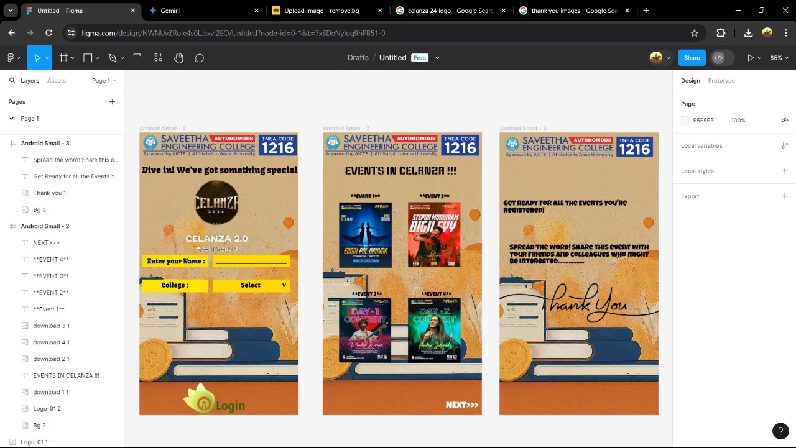

# Ex09 Event Registration Web Application
## Date: 18/05/2024

## AIM:
To design, develop and deploy a web application for event registration.

## DESIGN STEPS:

### Step 1:
Create a new frame.

### Step 2:
Select any one preset size of your choice.

### Step 3:
Select the shapes you need.

### Step 4:
Import images as needed.

### Step 5:
Create pages based on your need and link them.

### Step 6:

Validate the HTML and CSS code.

### Step 6:

Publish the website in the given URL.

## DESIGN TOOL:
Figma

## CODE:
Home page 

```
<div style="width: 360px; height: 640px; position: relative; background: white">
  
  <div style="width: 372px; height: 26px; left: 6px; top: 72px; position: absolute; color: black; font-size: 20px; font-family: Kavoon; font-weight: 400; word-wrap: break-word">Dive in! We've got something special</div>
  <div style="width: 149px; height: 28px; left: 7px; top: 277px; position: absolute; background: #F8E007"></div>
  <div style="width: 137px; height: 19px; left: 18px; top: 282px; position: absolute; color: black; font-size: 15px; font-family: Kavoon; font-weight: 400; word-wrap: break-word">Enter your Name :</div>
  <div style="width: 175px; height: 28px; left: 166px; top: 277px; position: absolute; background: #FFD703"></div>
  <div style="width: 170px; height: 21px; left: 173px; top: 280px; position: absolute; color: black; font-size: 15px; font-family: Kavoon; font-weight: 400; word-wrap: break-word">_____</div>
  <div style="width: 149px; height: 29px; left: 7px; top: 333px; position: absolute; background: #FFE500"></div>
  <div style="width: 136px; height: 26px; left: 50px; top: 336px; position: absolute; color: black; font-size: 15px; font-family: Kavoon; font-weight: 400; word-wrap: break-word">College :</div>
  <div style="width: 175px; height: 29px; left: 166px; top: 333px; position: absolute; background: #FFD707"></div>
  <div style="width: 48px; height: 17px; left: 230px; top: 336px; position: absolute; color: black; font-size: 15px; font-family: Kavoon; font-weight: 400; word-wrap: break-word">Select </div>
  <div style="width: 22px; height: 9px; left: 332px; top: 354.19px; position: absolute; transform: rotate(-179.50deg); transform-origin: 0 0; color: black; font-size: 15px; font-family: Kavoon; font-weight: 400; word-wrap: break-word">^</div>
  
  
</div>
```


Page 1 

```
<div style="width: 360px; height: 640px; position: relative; background: white">
  
  
  
  <div style="width: 272px; height: 33px; left: 50px; top: 71px; position: absolute; color: black; font-size: 24px; font-family: Keania One; font-weight: 400; word-wrap: break-word">EVENTS IN CELANZA !!!</div>
  
  
  
  <div style="width: 149px; height: 17px; left: 63px; top: 141px; position: absolute; color: black; font-size: 12px; font-family: Luckiest Guy; font-weight: 400; word-wrap: break-word">*Event 1*</div>
  <div style="width: 76px; height: 11px; left: 219px; top: 141px; position: absolute; color: black; font-size: 12px; font-family: Luckiest Guy; font-weight: 400; word-wrap: break-word">*EVENT 2*</div>
  <div style="width: 96px; height: 15px; left: 66px; top: 362px; position: absolute; color: black; font-size: 12px; font-family: Luckiest Guy; font-weight: 400; word-wrap: break-word">*EVENT 3*</div>
  <div style="width: 87px; height: 12px; left: 223px; top: 362px; position: absolute; color: black; font-size: 12px; font-family: Luckiest Guy; font-weight: 400; word-wrap: break-word">*EVENT 4*</div>
  <div style="width: 101px; height: 23px; left: 279px; top: 610px; position: absolute; color: white; font-size: 20px; font-family: Luckiest Guy; font-weight: 400; word-wrap: break-word">NEXT>>></div>
</div>
```


Page 2

```
<div style="width: 360px; height: 640px; position: relative; background: white">
  
  
  <div style="width: 341px; height: 26px; left: 9px; top: 154px; position: absolute; color: black; font-size: 16px; font-family: Luckiest Guy; font-weight: 400; word-wrap: break-word">Get Ready for all the Events You're Registered!</div>
  <div style="width: 333px; height: 86px; left: 23px; top: 254px; position: absolute; color: black; font-size: 16px; font-family: Luckiest Guy; font-weight: 400; word-wrap: break-word">Spread the word! Share this event with your friends and colleagues who might be interested.................</div>
</div>
```
## OUTPUT:


## RESULT:
The program to design, develop and deploy a web application for event registration is completed successfully.
